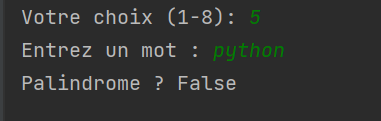

# **TP Algorithmique - Python**

### **Utilisation : menu interactif 

### **Exercice 1 : Recherche d'un élément dans une liste**

#### **1. Recherche séquentielle**

- Pour une liste de 10 000 éléments, le temps est `t` secondes.
- Pour une liste de 20 000 éléments, le temps nécessaire est d'environ `2 * t` secondes, car la complexité de l'algorithme séquentiel est **O(n)**.

####  **2. Implémentation et Complexité**

- Meilleur cas : **O(1)** (élément en première position)
- Pire cas et cas moyen : **O(n)** (élément en dernière position ou absent)

####  **3. Recherche dichotomique**

J'ai aussi implémenté la recherche dichotomique sur une liste triée.
- Meilleur cas : **O(1)**
- Cas moyen et pire cas : **O(log n)**

---
### **Exercice 2 : Récursivité**

#### **1. Factorielle récursive**

La fonction récursive est implémentée et fonctionnelle.

> * Exemple : `factorielle(5)`.*
> 

####  **2. Suite de Fibonacci récursive**

J'ai implémenté la fonction récursive calculant la suite de Fibonacci.

> * Exemple : `fibonacci(6)` .*
> 

####  **3. Vérification palindrome récursif**

> La fonction pour vérifier si un mot est un palindrome a été implémentée de façon récursive. 
>  &nbsp; 

---

### **Exercice 3 : Tableau ZigZag**

L'algorithme vérifiant si un tableau est en ZigZag est implémenté avec une complexité linéaire (**O(n)**), puisqu'il parcourt une seule fois le tableau.

> `[3,6,1,4,2,5]` et `[1,6,7,4,2,5]`.
> 
---

### **Explication :**
## **Exercice 4 : Optimisation de code**

### Ce que j'ai fait concrètement :
- J'ai analysé le code initial fourni qui parcourait une matrice en faisant une prédiction toutes les 5 lignes, mais seulement lorsque la différence exacte entre deux lignes successives était égale à 10.
- J'ai créé une méthode simple (`simule_modele`) pour imiter le comportement du modèle de machine learning (`clf`) demandé dans l'exercice.
- J'ai optimisé le code en remplaçant les boucles multiples et conditions complexes par une vérification directe en utilisant NumPy (`np.all`). Ceci permet d'éviter les boucles inutiles et accélère considérablement l'exécution.
- J'ai également clarifié l'ajout des résultats prédits directement dans une liste.

Cette optimisation réduit nettement le temps d'exécution initial en diminuant le nombre d'opérations effectuées par Python.
